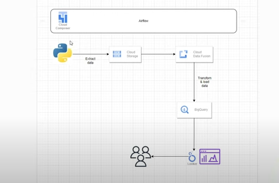

# 🌐 GCP Data Pipeline Project – Employee Data Analysis

## 🚀 Overview

This project demonstrates a complete end-to-end **data pipeline** built using **Google Cloud Platform (GCP)** services. We created a mock employee dataset and processed it through a modern data pipeline using:

- **Cloud Data Fusion** for data ingestion and transformation  
- **BigQuery** for data storage and analysis  
- **Cloud Composer (Airflow)** to orchestrate the pipeline using DAGs  
- **Looker Studio** to design business-focused KPI dashboards  

This project showcases how to turn raw data into meaningful insights using scalable cloud tools.

---

## 🧱 Architecture

### 📌 Architecture Diagram

**Flow Description**:
- Data is extracted using a Python script (scheduled with **Cloud Composer** / **Airflow**)
- Data is saved to **Cloud Storage**
- **Cloud Data Fusion** picks up the data, performs transformations, and loads it into **BigQuery**
- **Looker Studio** visualizes the processed data with business KPIs

---

## 🧰 Tools & Technologies

- **Google Cloud Platform (GCP)**  
  - Cloud Data Fusion  
  - BigQuery  
  - Cloud Storage  
  - Cloud Composer (Airflow)  
  - Looker Studio  
- Python / SQL

---

## 🗂️ Project Structure
gcp-data-pipeline-project/
│
├── data/                        # Contains raw and processed CSV files (mock employee data)
│
├── src/                          # Source code for data generation and orchestration
│   ├── generate_employee_data.py   # Generates dummy employee data with PII using Faker
│   ├── upload_to_gcs.py            # Uploads generated data to Google Cloud Storage
│   └── dags/
│       └── employee_pipeline_dag.py  # Airflow DAG for scheduling pipeline tasks
│
├── df-pipeline/                 # Cloud Data Fusion pipeline exported JSON (pipeline.json)
│
├── queries/                     # SQL scripts for BigQuery analysis
│   └── employee_kpi_query.sql     # Example query to extract KPI metrics
│
├── dashboards/                  # Looker Studio dashboard screenshots or shareable link
│   └── kpi_dashboard.png
│
├── configs/                     # Config files (e.g., schema definitions, GCP configs)
│
├── notebooks/                   # Jupyter notebooks for data exploration or prototyping
│
├── requirements.txt             # Python dependencies
├── .env.example                 # Sample environment variables file
├── Dockerfile                   # Optional: for containerizing pipeline components
├── architecture-diagram.png     # Project architecture visual
└── README.md                    # Project documentation

