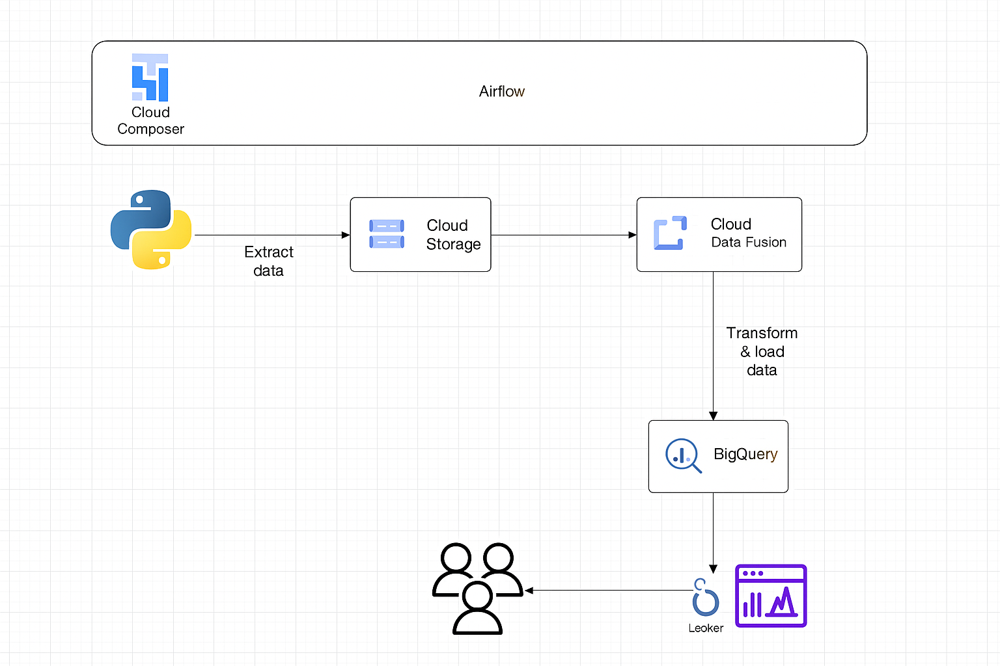
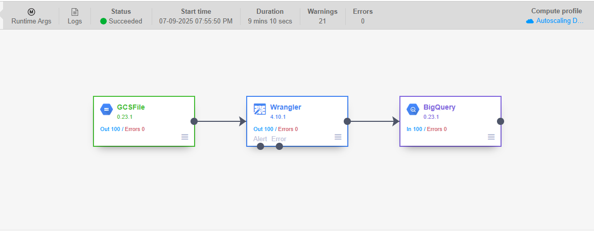
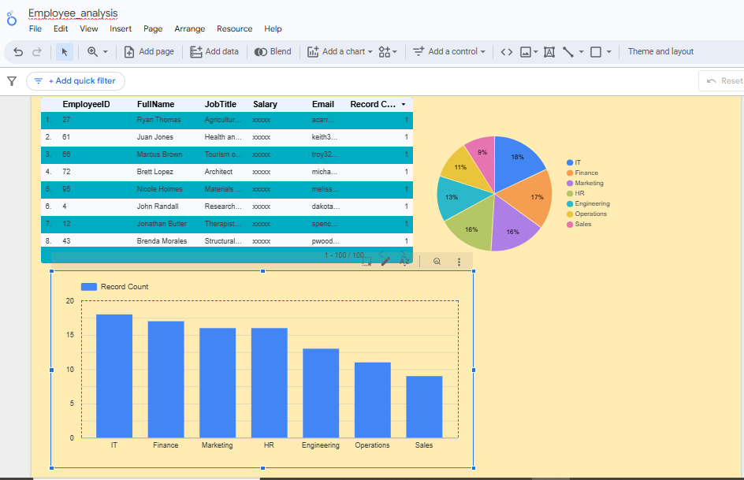

# 🌐 GCP Data Pipeline Project – Employee Data Analysis

## 🚀 Overview

This project demonstrates a complete end-to-end **data pipeline** built using **Google Cloud Platform (GCP)** services. We created a mock employee dataset and processed it through a modern data pipeline using:

- **Cloud Data Fusion** for data ingestion and transformation  
- **BigQuery** for data storage and analysis  
- **Cloud Composer (Airflow)** to orchestrate the pipeline using DAGs  
- **Looker Studio** to design business-focused KPI dashboards  

This project showcases how to turn raw data into meaningful insights using scalable cloud tools.

---

## 🧱 Architecture

### 📌 Architecture Diagram

**Flow Description**:
- Data is extracted using a Python script (scheduled with **Cloud Composer** / **Airflow**)
- Data is saved to **Cloud Storage**
- **Cloud Data Fusion** picks up the data, performs transformations, and loads it into **BigQuery**
- **Looker Studio** visualizes the processed data with business KPIs

---

## 🧰 Tools & Technologies

- **Google Cloud Platform (GCP)**  
  - Cloud Data Fusion  
  - BigQuery  
  - Cloud Storage  
  - Cloud Composer (Airflow)  
  - Looker Studio  
- Python / SQL

---

## 🗂️ Project Structure

gcp-data-pipeline-project/
│
├── data/  dummy_employee_data.csv                    

│
├── src/                         
│   ├── dummy_employees.py   
│   ├── upload_to_gcs.py           
│   └── dags/
│       └── dag.py  

│
├── df-pipeline/pipeline.png                

│
├── dashboards/                 
│   └── 

├── architecture-diagram.png     
└── README.md                    

